# RoomieTab — Technical Design Document

**Version:** 1.0
**Schema:** `roomietab`
**Last Updated:** 2025-02-26

---

## Table of Contents

1. [System Overview](#1-system-overview)
2. [Architecture Diagram](#2-architecture-diagram)
3. [Tech Stack](#3-tech-stack)
4. [Database Schema](#4-database-schema)
5. [SQL Migrations](#5-sql-migrations)
6. [Row-Level Security Policies](#6-row-level-security-policies)
7. [API Design](#7-api-design)
8. [Realtime Subscriptions](#8-realtime-subscriptions)
9. [Storage Configuration](#9-storage-configuration)
10. [Project Structure](#10-project-structure)
11. [Dependencies](#11-dependencies)

---

## 1. System Overview

### 1.1 Product Purpose

**RoomieTab** is a real-time roommate expense management web application designed for co-living groups of up to five people. It eliminates the friction of shared expense tracking by providing fast expense logging (sub-10-second capture), flexible split rules, and a mathematically optimal month-end settlement workflow — all without requiring every roommate to create a full account.

The core value proposition is three-fold:

- **Frictionless logging:** Add an expense with an amount, description, payer, and split in under 10 seconds from any screen via a persistent Floating Action Button.
- **Flexible splitting:** Support four split modes — equal, exact amounts, percentage-based, and custom shares/weights — to handle the diversity of real household expense arrangements.
- **Optimal settlement:** At month-end, a greedy net-balance algorithm computes the _minimum possible number of transactions_ required to fully settle all debts across the group, surfaced as a first-class workflow with one-tap payment deep links to Venmo, PayPal, and Zelle.

### 1.2 Target Audience

College students, young professionals, and co-living residents aged 18–35 who share a home with 2–5 roommates and need a lightweight, always-in-sync tool to track monthly shared expenses (rent, utilities, groceries, subscriptions) and settle debts fairly with minimal friction.

### 1.3 High-Level Architecture

RoomieTab is a **Next.js 15 (App Router)** application backed entirely by **Supabase** as its platform. The architecture is deliberately lean — favouring direct Supabase client queries protected by Row-Level Security over a heavyweight custom backend, while reserving API route handlers for complex server-side logic.

Key architectural decisions:

- **Database:** Seven tables in a dedicated `roomietab` PostgreSQL schema. All monetary values are stored as integer cents to eliminate floating-point rounding errors entirely. Row-Level Security (RLS) is enabled on every table, enforcing strict household-scoped data isolation at the database layer.
- **Authentication:** Supabase Auth with email magic links (zero-friction, no password to remember) and Google OAuth as a secondary provider. Guest members can join a household via a shareable invite link without mandatory account creation, drastically reducing adoption friction.
- **Realtime:** Supabase Realtime subscriptions on `expenses` and `settlement_transactions` provide live sync across all connected household members — balances and expense lists update without any manual page refresh.
- **API Layer:** Most read operations use direct Supabase client queries, protected by RLS. Next.js API Route Handlers handle complex server-side logic: the minimum-transaction settlement calculation, month archival, recurring expense generation, and file exports (CSV/PDF).
- **Storage:** Supabase Storage buckets for receipt images (5 MB limit, image-only MIME types) and member avatars (2 MB limit).
- **Performance:** Next.js Server Components for fast, fully-rendered initial page loads; optimistic UI updates for instant perceived responsiveness; and composite indexes on high-query paths (`household + date`, `household + month`).
- **Hosting & CI:** Deployed on Vercel with edge runtime for API routes and automatic preview deployments on pull requests. GitHub Actions handles lint, type-check, and build on every push and PR.

---

## 2. Architecture Diagram

```mermaid
graph TD
    subgraph Frontend["Frontend (Next.js 15 App Router)"]
        LP["Login Page"]
        OP["Onboarding Pages"]
        DP["Dashboard Page"]
        ELP["Expenses List Page"]
        AED["Add Expense Drawer"]
        SP["Settlement Page"]
        SETP["Settings Page"]
        UI["Shared UI Components"]
    end

    subgraph API["API Layer (Next.js Route Handlers)"]
        AH["POST /api/households"]
        AE["POST /api/expenses"]
        ASC["POST /api/settlements/calculate"]
        ASA["POST /api/settlements/archive"]
        ARG["POST /api/recurring/generate"]
        AEX["POST /api/export"]
        ARU["POST /api/receipts/upload"]
    end

    subgraph Supabase["Supabase Services"]
        AUTH["Supabase Auth\n(Magic Link + Google OAuth)"]
        DB["Supabase Database\n(PostgreSQL + RLS)"]
        RT["Supabase Realtime\n(Change Notifications)"]
        ST["Supabase Storage\n(Receipt Images)"]
        EF["Supabase Edge Functions\n(Recurring Cron)"]
    end

    subgraph External["External Services"]
        VDL["Venmo Deep Links"]
        PDL["PayPal Deep Links"]
        ZDL["Zelle Deep Links"]
        VH["Vercel Hosting"]
        GH["GitHub Actions CI"]
    end

    LP -->|"Email magic link / Google OAuth"| AUTH
    AUTH -->|"auth.uid() for RLS policies"| DB
    DP -->|"Direct Supabase client queries"| DB
    ELP -->|"Fetch expenses by household+month"| DB
    AED -->|"Insert expense+splits optimistic UI"| DB
    RT -->|"Live balance updates"| DP
    RT -->|"Real-time expense sync"| ELP
    SP -->|"Compute min transactions"| ASC
    SP -->|"One-tap payment links"| VDL
    SP -->|"One-tap payment links"| PDL
    SP -->|"One-tap payment links"| ZDL
    ASA -->|"Archive month + persist"| DB
    EF -->|"Auto-create recurring expenses"| DB
    AED -->|"Upload receipt photos"| ST
    ARU -->|"Store receipt files"| ST
    AEX -->|"Query monthly data"| DB
    OP -->|"Create household"| AH
    AH -->|"Insert household+member"| DB
    AE -->|"Atomic expense+splits insert"| DB
    ASC -->|"Query balances for algorithm"| DB

    style Frontend fill:#EEF2FF,stroke:#6366F1,stroke-width:2px
    style API fill:#E0F2FE,stroke:#0EA5E9,stroke-width:2px
    style Supabase fill:#DCFCE7,stroke:#059669,stroke-width:2px
    style External fill:#FEF3C7,stroke:#D97706,stroke-width:2px
```



---

## 3. Tech Stack

| Category | Technology | Version / Details |
|---|---|---|
| **Framework** | Next.js | 15.1 — App Router, Server Components, API Route Handlers |
| **UI Library** | React | 19.0 |
| **Styling** | Tailwind CSS | 3.4 — custom design system: indigo primary, Caveat/Inter fonts, hand-drawn shadow utilities |
| **Database** | Supabase PostgreSQL | Dedicated `roomietab` schema; integer-cents monetary storage; RLS on all tables |
| **Authentication** | Supabase Auth | Email magic link + Google OAuth; PKCE flow; cookie-based sessions via `@supabase/ssr` |
| **Realtime** | Supabase Realtime | PostgreSQL change notifications on `expenses` and `settlement_transactions` |
| **File Storage** | Supabase Storage | `receipts` bucket (5 MB) and `avatars` bucket (2 MB) |
| **Hosting** | Vercel | Edge Runtime for API routes; automatic preview deployments on PR |
| **CI/CD** | GitHub Actions | Lint, type-check, build on push and PR to `main` |
| **Form Management** | React Hook Form | 7.54 — with Zod resolvers |
| **Validation** | Zod | 3.24 — TypeScript-first schema validation |
| **Date Utilities** | date-fns | 4.1 — modular date formatting and manipulation |
| **Icons** | lucide-react | 0.468 — tree-shakeable, 1500+ icons |
| **Toast Notifications** | Sonner | 1.7 — with built-in action buttons (Undo) |
| **PDF Generation** | @react-pdf/renderer | 4.1 — server-side PDF export |
| **Type Safety** | TypeScript | 5.7 — strict mode, path aliases (`@/*`) |

---

## 4. Database Schema

All tables reside in the `roomietab` PostgreSQL schema. Monetary values are stored as **integer cents** throughout to eliminate floating-point arithmetic errors.

---

### 4.1 Household

**Table:** `roomietab.households`

Represents a shared living group. One household can have up to 5 active members.

#### Fields

| Column | Type | Nullable | Default | Description |
|---|---|---|---|---|
| `id` | `uuid` | No | `gen_random_uuid()` | Primary key |
| `name` | `text` | No | — | Household display name e.g. *Maple House* |
| `invite_code` | `text` | No | — | Unique shareable invite code for joining via link |
| `created_by` | `uuid` | No | — | FK → `auth.users` — the household creator/admin |
| `created_at` | `timestamptz` | No | `now()` | Creation timestamp |
| `updated_at` | `timestamptz` | No | `now()` | Last update timestamp (auto-maintained by trigger) |

#### Relations

| Type | Target Entity | Foreign Key |
|---|---|---|
| One-to-many | Member | `household_id` |
| One-to-many | Expense | `household_id` |
| One-to-many | Settlement | `household_id` |
| One-to-many | RecurringTemplate | `household_id` |

#### Indexes

```sql
CREATE UNIQUE INDEX idx_households_invite_code ON roomietab.households(invite_code);
```

---

### 4.2 Member

**Table:** `roomietab.members`

Represents a person within a household. `user_id` is nullable to support guest members who haven't created a Supabase Auth account. The `is_active` flag enables soft-deletion without destroying historical expense records.

#### Fields

| Column | Type | Nullable | Default | Description |
|---|---|---|---|---|
| `id` | `uuid` | No | `gen_random_uuid()` | Primary key |
| `household_id` | `uuid` | No | — | FK → `roomietab.households` |
| `user_id` | `uuid` | Yes | `NULL` | FK → `auth.users`; NULL for guest members who haven't signed up |
| `display_name` | `text` | No | — | Name shown in the app UI |
| `email` | `text` | Yes | `NULL` | Email used for invitations |
| `avatar_url` | `text` | Yes | `NULL` | Profile photo URL from Supabase Storage |
| `role` | `text` | No | `'member'` | Either `'admin'` or `'member'`; enforced by CHECK constraint |
| `venmo_handle` | `text` | Yes | `NULL` | Venmo username for pre-filled payment deep links |
| `paypal_email` | `text` | Yes | `NULL` | PayPal email for pre-filled payment deep links |
| `notification_prefs` | `jsonb` | No | `'{"new_expense": true, "tagged": true, "month_end": true, "recurring": false}'` | Push notification toggle preferences per event type |
| `is_active` | `boolean` | No | `true` | Soft-delete flag for removed members |
| `joined_at` | `timestamptz` | No | `now()` | When the member joined the household |
| `updated_at` | `timestamptz` | No | `now()` | Last update timestamp (auto-maintained by trigger) |

#### Relations

| Type | Target Entity | Foreign Key |
|---|---|---|
| One-to-many | Expense | `paid_by_member_id` |
| One-to-many | ExpenseSplit | `member_id` |

#### Indexes

```sql
CREATE INDEX idx_members_household_id ON roomietab.members(household_id);
CREATE INDEX idx_members_user_id ON roomietab.members(user_id);
CREATE UNIQUE INDEX idx_members_household_user
  ON roomietab.members(household_id, user_id)
  WHERE user_id IS NOT NULL;
```

> The partial unique index on `(household_id, user_id)` prevents a single authenticated user from joining the same household twice, while allowing multiple guest rows with `user_id = NULL`.

---

### 4.3 Expense

**Table:** `roomietab.expenses`

The central ledger record. Each expense captures the total amount in cents, who paid, how it is split, and optional metadata. Soft-deletion (`is_deleted`) preserves the audit trail without physically removing data.

#### Fields

| Column | Type | Nullable | Default | Description |
|---|---|---|---|---|
| `id` | `uuid` | No | `gen_random_uuid()` | Primary key |
| `household_id` | `uuid` | No | — | FK → `roomietab.households` |
| `description` | `text` | No | — | Short expense label e.g. *Whole Foods run* |
| `amount_cents` | `integer` | No | — | Total amount in cents; CHECK `> 0` |
| `category` | `text` | No | `'other'` | One of: `rent`, `utilities`, `groceries`, `dining`, `subscriptions`, `transport`, `household`, `other` |
| `split_type` | `text` | No | `'equal'` | Split method: `equal`, `exact`, `percentage`, `shares` |
| `paid_by_member_id` | `uuid` | No | — | FK → `roomietab.members` — who paid this expense |
| `expense_date` | `date` | No | `CURRENT_DATE` | Date the expense occurred |
| `receipt_url` | `text` | Yes | `NULL` | URL to receipt image stored in Supabase Storage |
| `is_recurring` | `boolean` | No | `false` | True if this was auto-generated from a recurring template |
| `recurring_day` | `integer` | Yes | `NULL` | Day of month for display purposes (1–31) |
| `recurring_template_id` | `uuid` | Yes | `NULL` | FK → `roomietab.recurring_templates` that generated this row |
| `is_deleted` | `boolean` | No | `false` | Soft-delete flag — hidden from UI but retained for audit |
| `created_at` | `timestamptz` | No | `now()` | Creation timestamp |
| `updated_at` | `timestamptz` | No | `now()` | Last update timestamp (auto-maintained by trigger) |

#### Relations

| Type | Target Entity | Foreign Key |
|---|---|---|
| One-to-many | ExpenseSplit | `expense_id` |

#### Indexes

```sql
CREATE INDEX idx_expenses_household_id ON roomietab.expenses(household_id);
CREATE INDEX idx_expenses_paid_by ON roomietab.expenses(paid_by_member_id);

-- Composite partial indexes for high-frequency query paths
CREATE INDEX idx_expenses_household_date
  ON roomietab.expenses(household_id, expense_date DESC)
  WHERE is_deleted = false;

CREATE INDEX idx_expenses_household_month
  ON roomietab.expenses(household_id, date_trunc('month', expense_date))
  WHERE is_deleted = false;

CREATE INDEX idx_expenses_category
  ON roomietab.expenses(household_id, category)
  WHERE is_deleted = false;
```

---

### 4.4 ExpenseSplit

**Table:** `roomietab.expense_splits`

Stores each member's individual share of a given expense. One row per member per expense. The `amount_cents` column always reflects the final resolved share in cents regardless of the parent expense's `split_type`. The `percentage` and `shares` columns are stored for auditability and re-calculation when editing.

#### Fields

| Column | Type | Nullable | Default | Description |
|---|---|---|---|---|
| `id` | `uuid` | No | `gen_random_uuid()` | Primary key |
| `expense_id` | `uuid` | No | — | FK → `roomietab.expenses` (CASCADE DELETE) |
| `member_id` | `uuid` | No | — | FK → `roomietab.members` — who owes this share |
| `amount_cents` | `integer` | No | — | This member's share in cents; CHECK `>= 0` |
| `percentage` | `numeric(5,2)` | Yes | `NULL` | Percentage value when `split_type = 'percentage'`; CHECK 0–100 |
| `shares` | `integer` | Yes | `NULL` | Number of shares when `split_type = 'shares'`; CHECK `>= 0` |
| `created_at` | `timestamptz` | No | `now()` | Creation timestamp |

#### Relations

None (leaf table; accessed via `expense_id`).

#### Indexes

```sql
CREATE INDEX idx_splits_expense_id ON roomietab.expense_splits(expense_id);
CREATE INDEX idx_splits_member_id ON roomietab.expense_splits(member_id);
CREATE UNIQUE INDEX idx_splits_expense_member
  ON roomietab.expense_splits(expense_id, member_id);
```

---

### 4.5 RecurringTemplate

**Table:** `roomietab.recurring_templates`

Defines a recurring monthly expense. A daily Supabase Edge Function cron job checks active templates whose `day_of_month` matches the current date and auto-inserts the corresponding expense and splits. The `split_config` JSONB field stores the per-member split configuration as a JSON array, avoiding a separate config table.

#### Fields

| Column | Type | Nullable | Default | Description |
|---|---|---|---|---|
| `id` | `uuid` | No | `gen_random_uuid()` | Primary key |
| `household_id` | `uuid` | No | — | FK → `roomietab.households` |
| `description` | `text` | No | — | Expense description template e.g. *Netflix* |
| `amount_cents` | `integer` | No | — | Amount in cents; CHECK `> 0` |
| `category` | `text` | No | — | Expense category (same CHECK as `expenses`) |
| `split_type` | `text` | No | `'equal'` | Split method (same CHECK as `expenses`) |
| `paid_by_member_id` | `uuid` | No | — | FK → `roomietab.members` — default payer |
| `split_config` | `jsonb` | No | `'[]'` | JSON array of split member configs: `[{memberId, amountCents?, percentage?, shares?}]` |
| `day_of_month` | `integer` | No | — | Day of month to auto-create expense (1–31) |
| `is_active` | `boolean` | No | `true` | Whether the template is active (soft-delete) |
| `last_generated_at` | `timestamptz` | Yes | `NULL` | Timestamp of last auto-generated expense |
| `created_at` | `timestamptz` | No | `now()` | Creation timestamp |
| `updated_at` | `timestamptz` | No | `now()` | Last update timestamp (auto-maintained by trigger) |

#### Relations

None (referenced by `expenses.recurring_template_id`).

#### Indexes

```sql
CREATE INDEX idx_recurring_household ON roomietab.recurring_templates(household_id);
CREATE INDEX idx_recurring_active_day
  ON roomietab.recurring_templates(day_of_month)
  WHERE is_active = true;
```

---

### 4.6 Settlement

**Table:** `roomietab.settlements`

Represents a month's settlement record. One row per household per calendar month, created when an admin archives the month. Contains metadata about the archive action; the actual payment instructions live in `settlement_transactions`.

#### Fields

| Column | Type | Nullable | Default | Description |
|---|---|---|---|---|
| `id` | `uuid` | No | `gen_random_uuid()` | Primary key |
| `household_id` | `uuid` | No | — | FK → `roomietab.households` |
| `month` | `date` | No | — | First day of the settlement month (e.g. `2025-02-01`) |
| `is_archived` | `boolean` | No | `false` | Whether the month has been fully archived/settled |
| `archived_at` | `timestamptz` | Yes | `NULL` | When the month was archived |
| `archived_by` | `uuid` | Yes | `NULL` | FK → `roomietab.members` who performed the archive action |
| `created_at` | `timestamptz` | No | `now()` | Creation timestamp |
| `updated_at` | `timestamptz` | No | `now()` | Last update timestamp (auto-maintained by trigger) |

#### Relations

| Type | Target Entity | Foreign Key |
|---|---|---|
| One-to-many | SettlementTransaction | `settlement_id` |

#### Indexes

```sql
CREATE INDEX idx_settlements_household ON roomietab.settlements(household_id);
CREATE UNIQUE INDEX idx_settlements_household_month
  ON roomietab.settlements(household_id, month);
```

---

### 4.7 SettlementTransaction

**Table:** `roomietab.settlement_transactions`

Stores the individual minimum-transaction payment instructions computed by the greedy net-balance algorithm for a given settlement month. Each row represents a single debt: `payer_member_id` owes `amount_cents` to `receiver_member_id`. A CHECK constraint prevents self-payments. Members toggle `is_settled` as they complete real-world payments.

#### Fields

| Column | Type | Nullable | Default | Description |
|---|---|---|---|---|
| `id` | `uuid` | No | `gen_random_uuid()` | Primary key |
| `settlement_id` | `uuid` | No | — | FK → `roomietab.settlements` (CASCADE DELETE) |
| `payer_member_id` | `uuid` | No | — | FK → `roomietab.members` — who needs to pay |
| `receiver_member_id` | `uuid` | No | — | FK → `roomietab.members` — who receives payment |
| `amount_cents` | `integer` | No | — | Transaction amount in cents; CHECK `> 0` |
| `is_settled` | `boolean` | No | `false` | Whether this transaction has been completed |
| `settled_at` | `timestamptz` | Yes | `NULL` | When marked as settled |
| `created_at` | `timestamptz` | No | `now()` | Creation timestamp |

> **Constraint:** `CHECK (payer_member_id != receiver_member_id)` — a member cannot be recorded as paying themselves.

#### Relations

None (leaf table; accessed via `settlement_id`).

#### Indexes

```sql
CREATE INDEX idx_stxn_settlement ON roomietab.settlement_transactions(settlement_id);
CREATE INDEX idx_stxn_payer ON roomietab.settlement_transactions(payer_member_id);
CREATE INDEX idx_stxn_receiver ON roomietab.settlement_transactions(receiver_member_id);
```

---

## 5. SQL Migrations

Migrations are applied in numerical order using the Supabase CLI (`supabase db push` / `supabase migration up`). Files reside at `supabase/migrations/`.

---

### Migration 00001 — Create Schema

```sql
-- Create dedicated schema for RoomieTab
CREATE SCHEMA IF NOT EXISTS roomietab;
```

---

### Migration 00002 — Create Households

```sql
CREATE TABLE roomietab.households (
  id uuid PRIMARY KEY DEFAULT gen_random_uuid(),
  name text NOT NULL,
  invite_code text NOT NULL,
  created_by uuid NOT NULL REFERENCES auth.users(id),
  created_at timestamptz NOT NULL DEFAULT now(),
  updated_at timestamptz NOT NULL DEFAULT now()
);

CREATE UNIQUE INDEX idx_households_invite_code
  ON roomietab.households(invite_code);
```

---

### Migration 00003 — Create Members

```sql
CREATE TABLE roomietab.members (
  id uuid PRIMARY KEY DEFAULT gen_random_uuid(),
  household_id uuid NOT NULL
    REFERENCES roomietab.households(id) ON DELETE CASCADE,
  user_id uuid REFERENCES auth.users(id),
  display_name text NOT NULL,
  email text,
  avatar_url text,
  role text NOT NULL DEFAULT 'member'
    CHECK (role IN ('admin', 'member')),
  venmo_handle text,
  paypal_email text,
  notification_prefs jsonb NOT NULL DEFAULT
    '{"new_expense": true, "tagged": true, "month_end": true, "recurring": false}'::jsonb,
  is_active boolean NOT NULL DEFAULT true,
  joined_at timestamptz NOT NULL DEFAULT now(),
  updated_at timestamptz NOT NULL DEFAULT now()
);

CREATE INDEX idx_members_household_id ON roomietab.members(household_id);
CREATE INDEX idx_members_user_id ON roomietab.members(user_id);
CREATE UNIQUE INDEX idx_members_household_user
  ON roomietab.members(household_id, user_id)
  WHERE user_id IS NOT NULL;
```

---

### Migration 00004 — Create Expenses

```sql
CREATE TABLE roomietab.expenses (
  id uuid PRIMARY KEY DEFAULT gen_random_uuid(),
  household_id uuid NOT NULL
    REFERENCES roomietab.households(id) ON DELETE CASCADE,
  description text NOT NULL,
  amount_cents integer NOT NULL CHECK (amount_cents > 0),
  category text NOT NULL DEFAULT 'other'
    CHECK (category IN (
      'rent', 'utilities', 'groceries', 'dining',
      'subscriptions', 'transport', 'household', 'other'
    )),
  split_type text NOT NULL DEFAULT 'equal'
    CHECK (split_type IN ('equal', 'exact', 'percentage', 'shares')),
  paid_by_member_id uuid NOT NULL REFERENCES roomietab.members(id),
  expense_date date NOT NULL DEFAULT CURRENT_DATE,
  receipt_url text,
  is_recurring boolean NOT NULL DEFAULT false,
  recurring_day integer CHECK (recurring_day >= 1 AND recurring_day <= 31),
  recurring_template_id uuid,
  is_deleted boolean NOT NULL DEFAULT false,
  created_at timestamptz NOT NULL DEFAULT now(),
  updated_at timestamptz NOT NULL DEFAULT now()
);

CREATE INDEX idx_expenses_household_id ON roomietab.expenses(household_id);
CREATE INDEX idx_expenses_paid_by ON roomietab.expenses(paid_by_member_id);
CREATE INDEX idx_expenses_household_date
  ON roomietab.expenses(household_id, expense_date DESC)
  WHERE is_deleted = false;
CREATE INDEX idx_expenses_category
  ON roomietab.expenses(household_id, category)
  WHERE is_deleted = false;
```

---

### Migration 00005 — Create Expense Splits

```sql
CREATE TABLE roomietab.expense_splits (
  id uuid PRIMARY KEY DEFAULT gen_random_uuid(),
  expense_id uuid NOT NULL
    REFERENCES roomietab.expenses(id) ON DELETE CASCADE,
  member_id uuid NOT NULL REFERENCES roomietab.members(id),
  amount_cents integer NOT NULL CHECK (amount_cents >= 0),
  percentage numeric(5,2) CHECK (percentage >= 0 AND percentage <= 100),
  shares integer CHECK (shares >= 0),
  created_at timestamptz NOT NULL DEFAULT now()
);

CREATE INDEX idx_splits_expense_id ON roomietab.expense_splits(expense_id);
CREATE INDEX idx_splits_member_id ON roomietab.expense_splits(member_id);
CREATE UNIQUE INDEX idx_splits_expense_member
  ON roomietab.expense_splits(expense_id, member_id);
```

---

### Migration 00006 — Create Recurring Templates

```sql
CREATE TABLE roomietab.recurring_templates (
  id uuid PRIMARY KEY DEFAULT gen_random_uuid(),
  household_id uuid NOT NULL
    REFERENCES roomietab.households(id) ON DELETE CASCADE,
  description text NOT NULL,
  amount_cents integer NOT NULL CHECK (amount_cents > 0),
  category text NOT NULL
    CHECK (category IN (
      'rent', 'utilities', 'groceries', 'dining',
      'subscriptions', 'transport', 'household', 'other'
    )),
  split_type text NOT NULL DEFAULT 'equal'
    CHECK (split_type IN ('equal', 'exact', 'percentage', 'shares')),
  paid_by_member_id uuid NOT NULL REFERENCES roomietab.members(id),
  split_config jsonb NOT NULL DEFAULT '[]'::jsonb,
  day_of_month integer NOT NULL CHECK (day_of_month >= 1 AND day_of_month <= 31),
  is_active boolean NOT NULL DEFAULT true,
  last_generated_at timestamptz,
  created_at timestamptz NOT NULL DEFAULT now(),
  updated_at timestamptz NOT NULL DEFAULT now()
);

CREATE INDEX idx_recurring_household
  ON roomietab.recurring_templates(household_id);
CREATE INDEX idx_recurring_active_day
  ON roomietab.recurring_templates(day_of_month)
  WHERE is_active = true;
```

---

### Migration 00007 — Create Settlements

```sql
CREATE TABLE roomietab.settlements (
  id uuid PRIMARY KEY DEFAULT gen_random_uuid(),
  household_id uuid NOT NULL
    REFERENCES roomietab.households(id) ON DELETE CASCADE,
  month date NOT NULL,
  is_archived boolean NOT NULL DEFAULT false,
  archived_at timestamptz,
  archived_by uuid REFERENCES roomietab.members(id),
  created_at timestamptz NOT NULL DEFAULT now(),
  updated_at timestamptz NOT NULL DEFAULT now()
);

CREATE INDEX idx_settlements_household ON roomietab.settlements(household_id);
CREATE UNIQUE INDEX idx_settlements_household_month
  ON roomietab.settlements(household_id, month);

CREATE TABLE roomietab.settlement_transactions (
  id uuid PRIMARY KEY DEFAULT gen_random_uuid(),
  settlement_id uuid NOT NULL
    REFERENCES roomietab.settlements(id) ON DELETE CASCADE,
  payer_member_id uuid NOT NULL REFERENCES roomietab.members(id),
  receiver_member_id uuid NOT NULL REFERENCES roomietab.members(id),
  amount_cents integer NOT NULL CHECK (amount_cents > 0),
  is_settled boolean NOT NULL DEFAULT false,
  settled_at timestamptz,
  created_at timestamptz NOT NULL DEFAULT now(),
  CHECK (payer_member_id != receiver_member_id)
);

CREATE INDEX idx_stxn_settlement
  ON roomietab.settlement_transactions(settlement_id);
CREATE INDEX idx_stxn_payer
  ON roomietab.settlement_transactions(payer_member_id);
CREATE INDEX idx_stxn_receiver
  ON roomietab.settlement_transactions(receiver_member_id);
```

---

### Migration 00008 — Enable Row-Level Security

```sql
-- Enable RLS on all tables
ALTER TABLE roomietab.households ENABLE ROW LEVEL SECURITY;
ALTER TABLE roomietab.members ENABLE ROW LEVEL SECURITY;
ALTER TABLE roomietab.expenses ENABLE ROW LEVEL SECURITY;
ALTER TABLE roomietab.expense_splits ENABLE ROW LEVEL SECURITY;
ALTER TABLE roomietab.recurring_templates ENABLE ROW LEVEL SECURITY;
ALTER TABLE roomietab.settlements ENABLE ROW LEVEL SECURITY;
ALTER TABLE roomietab.settlement_transactions ENABLE ROW LEVEL SECURITY;

-- Households policies
CREATE POLICY "Users can view households they belong to"
  ON roomietab.households FOR SELECT USING (
    EXISTS (
      SELECT 1 FROM roomietab.members
      WHERE members.household_id = households.id
        AND members.user_id = auth.uid()
        AND members.is_active = true
    )
  );

CREATE POLICY "Authenticated users can create households"
  ON roomietab.households FOR INSERT
  WITH CHECK (auth.uid() = created_by);

CREATE POLICY "Only admin can update household"
  ON roomietab.households FOR UPDATE USING (
    EXISTS (
      SELECT 1 FROM roomietab.members
      WHERE members.household_id = households.id
        AND members.user_id = auth.uid()
        AND members.role = 'admin'
        AND members.is_active = true
    )
  );

-- Members policies
CREATE POLICY "Members can view other members in their household"
  ON roomietab.members FOR SELECT USING (
    EXISTS (
      SELECT 1 FROM roomietab.members AS m
      WHERE m.household_id = members.household_id
        AND m.user_id = auth.uid()
        AND m.is_active = true
    )
  );

CREATE POLICY "Users can insert themselves as members"
  ON roomietab.members FOR INSERT WITH CHECK (
    user_id = auth.uid()
    OR EXISTS (
      SELECT 1 FROM roomietab.members AS m
      WHERE m.household_id = members.household_id
        AND m.user_id = auth.uid()
        AND m.role = 'admin'
    )
  );

CREATE POLICY "Members can update their own profile"
  ON roomietab.members FOR UPDATE USING (user_id = auth.uid());

-- Expenses policies
CREATE POLICY "Members can view expenses in their household"
  ON roomietab.expenses FOR SELECT USING (
    EXISTS (
      SELECT 1 FROM roomietab.members
      WHERE members.household_id = expenses.household_id
        AND members.user_id = auth.uid()
        AND members.is_active = true
    )
  );

CREATE POLICY "Members can create expenses in their household"
  ON roomietab.expenses FOR INSERT WITH CHECK (
    EXISTS (
      SELECT 1 FROM roomietab.members
      WHERE members.household_id = expenses.household_id
        AND members.user_id = auth.uid()
        AND members.is_active = true
    )
  );

CREATE POLICY "Members can update expenses in their household"
  ON roomietab.expenses FOR UPDATE USING (
    EXISTS (
      SELECT 1 FROM roomietab.members
      WHERE members.household_id = expenses.household_id
        AND members.user_id = auth.uid()
        AND members.is_active = true
    )
  );

CREATE POLICY "Members can soft-delete expenses in their household"
  ON roomietab.expenses FOR DELETE USING (
    EXISTS (
      SELECT 1 FROM roomietab.members
      WHERE members.household_id = expenses.household_id
        AND members.user_id = auth.uid()
        AND members.is_active = true
    )
  );

-- Expense splits policies
CREATE POLICY "Members can view splits for expenses in their household"
  ON roomietab.expense_splits FOR SELECT USING (
    EXISTS (
      SELECT 1 FROM roomietab.expenses e
      JOIN roomietab.members m ON m.household_id = e.household_id
      WHERE e.id = expense_splits.expense_id
        AND m.user_id = auth.uid()
        AND m.is_active = true
    )
  );

CREATE POLICY "Members can create splits for expenses in their household"
  ON roomietab.expense_splits FOR INSERT WITH CHECK (
    EXISTS (
      SELECT 1 FROM roomietab.expenses e
      JOIN roomietab.members m ON m.household_id = e.household_id
      WHERE e.id = expense_splits.expense_id
        AND m.user_id = auth.uid()
        AND m.is_active = true
    )
  );

CREATE POLICY "Members can update splits for expenses in their household"
  ON roomietab.expense_splits FOR UPDATE USING (
    EXISTS (
      SELECT 1 FROM roomietab.expenses e
      JOIN roomietab.members m ON m.household_id = e.household_id
      WHERE e.id = expense_splits.expense_id
        AND m.user_id = auth.uid()
        AND m.is_active = true
    )
  );

CREATE POLICY "Members can delete splits for expenses in their household"
  ON roomietab.expense_splits FOR DELETE USING (
    EXISTS (
      SELECT 1 FROM roomietab.expenses e
      JOIN roomietab.members m ON m.household_id = e.household_id
      WHERE e.id = expense_splits.expense_id
        AND m.user_id = auth.uid()
        AND m.is_active = true
    )
  );

-- Recurring templates policies
CREATE POLICY "Members can view recurring templates in their household"
  ON roomietab.recurring_templates FOR SELECT USING (
    EXISTS (
      SELECT 1 FROM roomietab.members
      WHERE members.household_id = recurring_templates.household_id
        AND members.user_id = auth.uid()
        AND members.is_active = true
    )
  );

CREATE POLICY "Members can create recurring templates"
  ON roomietab.recurring_templates FOR INSERT WITH CHECK (
    EXISTS (
      SELECT 1 FROM roomietab.members
      WHERE members.household_id = recurring_templates.household_id
        AND members.user_id = auth.uid()
        AND members.is_active = true
    )
  );

CREATE POLICY "Members can update recurring templates"
  ON roomietab.recurring_templates FOR UPDATE USING (
    EXISTS (
      SELECT 1 FROM roomietab.members
      WHERE members.household_id = recurring_templates.household_id
        AND members.user_id = auth.uid()
        AND members.is_active = true
    )
  );

-- Settlements policies
CREATE POLICY "Members can view settlements in their household"
  ON roomietab.settlements FOR SELECT USING (
    EXISTS (
      SELECT 1 FROM roomietab.members
      WHERE members.household_id = settlements.household_id
        AND members.user_id = auth.uid()
        AND members.is_active = true
    )
  );

CREATE POLICY "Members can create settlements"
  ON roomietab.settlements FOR INSERT WITH CHECK (
    EXISTS (
      SELECT 1 FROM roomietab.members
      WHERE members.household_id = settlements.household_id
        AND members.user_id = auth.uid()
        AND members.is_active = true
    )
  );

CREATE POLICY "Members can update settlements"
  ON roomietab.settlements FOR UPDATE USING (
    EXISTS (
      SELECT 1 FROM roomietab.members
      WHERE members.household_id = settlements.household_id
        AND members.user_id = auth.uid()
        AND members.is_active = true
    )
  );

-- Settlement transactions policies
CREATE POLICY "Members can view settlement transactions"
  ON roomietab.settlement_transactions FOR SELECT USING (
    EXISTS (
      SELECT 1 FROM roomietab.settlements s
      JOIN roomietab.members m ON m.household_id = s.household_id
      WHERE s.id = settlement_transactions.settlement_id
        AND m.user_id = auth.uid()
        AND m.is_active = true
    )
  );

CREATE POLICY "Members can create settlement transactions"
  ON roomietab.settlement_transactions FOR INSERT WITH CHECK (
    EXISTS (
      SELECT 1 FROM roomietab.settlements s
      JOIN roomietab.members m ON m.household_id = s.household_id
      WHERE s.id = settlement_transactions.settlement_id
        AND m.user_id = auth.uid()
        AND m.is_active = true
    )
  );

CREATE POLICY "Members can update settlement transactions"
  ON roomietab.settlement_transactions FOR UPDATE USING (
    EXISTS (
      SELECT 1 FROM roomietab.settlements s
      JOIN roomietab.members m ON m.household_id = s.household_id
      WHERE s.id = settlement_transactions.settlement_id
        AND m.user_id = auth.uid()
        AND m.is_active = true
    )
  );
```

---

### Migration 00009 — Enable Realtime

```sql
-- Enable Supabase Realtime for live sync tables
ALTER PUBLICATION supabase_realtime ADD TABLE roomietab.expenses;
ALTER PUBLICATION supabase_realtime ADD TABLE roomietab.settlement_transactions;
```

---

### Migration 00010 — Updated-At Triggers

```sql
-- Auto-update updated_at timestamp on row modification
CREATE OR REPLACE FUNCTION roomietab.update_updated_at()
RETURNS TRIGGER AS $$
BEGIN
  NEW.updated_at = now();
  RETURN NEW;
END;
$$ LANGUAGE plpgsql;

CREATE TRIGGER set_updated_at
  BEFORE UPDATE ON roomietab.households
  FOR EACH ROW EXECUTE FUNCTION roomietab.update_updated_at();

CREATE TRIGGER set_updated_at
  BEFORE UPDATE ON roomietab.members
  FOR EACH ROW EXECUTE FUNCTION roomietab.update_updated_at();

CREATE TRIGGER set_updated_at
  BEFORE UPDATE ON roomietab.expenses
  FOR EACH ROW EXECUTE FUNCTION roomietab.update_updated_at();

CREATE TRIGGER set_updated_at
  BEFORE UPDATE ON roomietab.recurring_templates
  FOR EACH ROW EXECUTE FUNCTION roomietab.update_updated_at();

CREATE TRIGGER set_updated_at
  BEFORE UPDATE ON roomietab.settlements
  FOR EACH ROW EXECUTE FUNCTION roomietab.update_updated_at();
```

---

## 6. Row-Level Security Policies

All seven tables in the `roomietab` schema have RLS enabled. The access model is **household-scoped**: a user may only read or write rows that belong to a household in which they hold an active `members` record linked to `auth.uid()`.

| Table | Policy Name | Operation | USING Expression | WITH CHECK Expression |
|---|---|---|---|---|
| `roomietab.households` | Users can view households they belong to | SELECT | `EXISTS (SELECT 1 FROM roomietab.members WHERE members.household_id = households.id AND members.user_id = auth.uid() AND members.is_active = true)` | — |
| `roomietab.households` | Authenticated users can create households | INSERT | `true` | `auth.uid() = created_by` |
| `roomietab.households` | Only admin can update household | UPDATE | `EXISTS (SELECT 1 FROM roomietab.members WHERE members.household_id = households.id AND members.user_id = auth.uid() AND members.role = 'admin' AND members.is_active = true)` | — |
| `roomietab.members` | Members can view other members in their household | SELECT | `EXISTS (SELECT 1 FROM roomietab.members AS m WHERE m.household_id = members.household_id AND m.user_id = auth.uid() AND m.is_active = true)` | — |
| `roomietab.members` | Users can insert themselves as members | INSERT | `true` | `user_id = auth.uid() OR EXISTS (SELECT 1 FROM roomietab.members AS m WHERE m.household_id = members.household_id AND m.user_id = auth.uid() AND m.role = 'admin')` |
| `roomietab.members` | Members can update their own profile | UPDATE | `user_id = auth.uid()` | — |
| `roomietab.expenses` | Members can view expenses in their household | SELECT | `EXISTS (SELECT 1 FROM roomietab.members WHERE members.household_id = expenses.household_id AND members.user_id = auth.uid() AND members.is_active = true)` | — |
| `roomietab.expenses` | Members can create expenses in their household | INSERT | `true` | `EXISTS (SELECT 1 FROM roomietab.members WHERE members.household_id = expenses.household_id AND members.user_id = auth.uid() AND members.is_active = true)` |
| `roomietab.expenses` | Members can update expenses in their household | UPDATE | `EXISTS (SELECT 1 FROM roomietab.members WHERE members.household_id = expenses.household_id AND members.user_id = auth.uid() AND members.is_active = true)` | — |
| `roomietab.expenses` | Members can soft-delete expenses in their household | DELETE | `EXISTS (SELECT 1 FROM roomietab.members WHERE members.household_id = expenses.household_id AND members.user_id = auth.uid() AND members.is_active = true)` | — |
| `roomietab.expense_splits` | Members can view splits for expenses in their household | SELECT | `EXISTS (SELECT 1 FROM roomietab.expenses e JOIN roomietab.members m ON m.household_id = e.household_id WHERE e.id = expense_splits.expense_id AND m.user_id = auth.uid() AND m.is_active = true)` | — |
| `roomietab.expense_splits` | Members can create splits for expenses in their household | INSERT | `true` | `EXISTS (SELECT 1 FROM roomietab.expenses e JOIN roomietab.members m ON m.household_id = e.household_id WHERE e.id = expense_splits.expense_id AND m.user_id = auth.uid() AND m.is_active = true)` |
| `roomietab.expense_splits` | Members can update splits for expenses in their household | UPDATE | `EXISTS (SELECT 1 FROM roomietab.expenses e JOIN roomietab.members m ON m.household_id = e.household_id WHERE e.id = expense_splits.expense_id AND m.user_id = auth.uid() AND m.is_active = true)` | — |
| `roomietab.expense_splits` | Members can delete splits for expenses in their household | DELETE | `EXISTS (SELECT 1 FROM roomietab.expenses e JOIN roomietab.members m ON m.household_id = e.household_id WHERE e.id = expense_splits.expense_id AND m.user_id = auth.uid() AND m.is_active = true)` | — |
| `roomietab.recurring_templates` | Members can view recurring templates in their household | SELECT | `EXISTS (SELECT 1 FROM roomietab.members WHERE members.household_id = recurring_templates.household_id AND members.user_id = auth.uid() AND members.is_active = true)` | — |
| `roomietab.recurring_templates` | Members can create recurring templates in their household | INSERT | `true` | `EXISTS (SELECT 1 FROM roomietab.members WHERE members.household_id = recurring_templates.household_id AND members.user_id = auth.uid() AND members.is_active = true)` |
| `roomietab.recurring_templates` | Members can update recurring templates in their household | UPDATE | `EXISTS (SELECT 1 FROM roomietab.members WHERE members.household_id = recurring_templates.household_id AND members.user_id = auth.uid() AND members.is_active = true)` | — |
| `roomietab.settlements` | Members can view settlements in their household | SELECT | `EXISTS (SELECT 1 FROM roomietab.members WHERE members.household_id = settlements.household_id AND members.user_id = auth.uid() AND members.is_active = true)` | — |
| `roomietab.settlements` | Members can create settlements in their household | INSERT | `true` | `EXISTS (SELECT 1 FROM roomietab.members WHERE members.household_id = settlements.household_id AND members.user_id = auth.uid() AND members.is_active = true)` |
| `roomietab.settlements` | Members can update settlements in their household | UPDATE | `EXISTS (SELECT 1 FROM roomietab.members WHERE members.household_id = settlements.household_id AND members.user_id = auth.uid() AND members.is_active = true)` | — |
| `roomietab.settlement_transactions` | Members can view settlement transactions via household | SELECT | `EXISTS (SELECT 1 FROM roomietab.settlements s JOIN roomietab.members m ON m.household_id = s.household_id WHERE s.id = settlement_transactions.settlement_id AND m.user_id = auth.uid() AND m.is_active = true)` | — |
| `roomietab.settlement_transactions` | Members can create settlement transactions via household | INSERT | `true` | `EXISTS (SELECT 1 FROM roomietab.settlements s JOIN roomietab.members m ON m.household_id = s.household_id WHERE s.id = settlement_transactions.settlement_id AND m.user_id = auth.uid() AND m.is_active = true)` |
| `roomietab.settlement_transactions` | Members can update settlement transactions via household | UPDATE | `EXISTS (SELECT 1 FROM roomietab.settlements s JOIN roomietab.members m ON m.household_id = s.household_id WHERE s.id = settlement_transactions.settlement_id AND m.user_id = auth.uid() AND m.is_active = true)` | — |

---

## 7. API Design

### 7.1 Route Reference

All API routes are implemented as Next.js Route Handlers under `src/app/api/`. Routes marked **Auth Required: Yes** validate the caller's Supabase session server-side and reject unauthenticated requests with `401 Unauthorized`.

| Method | Path | Auth Required | Description | Request Body | Response Type |
|---|---|---|---|---|---|
| `POST` | `/api/households` | Yes | Create a new household with the authenticated user as admin. Creates household row, initial member row, and generates unique invite code atomically. | `{ name: string, displayName: string }` | `{ household: Household, member: Member }` |
| `PUT` | `/api/households/[id]` | Yes | Update household name. Only admin members are permitted. | `{ name: string }` | `{ household: Household }` |
| `POST` | `/api/households/[id]/join` | Yes | Join a household via invite code. Creates a new member record linked to the authenticated user. Enforces maximum of 5 active members. | `{ inviteCode: string, displayName: string }` | `{ member: Member }` |
| `POST` | `/api/households/[id]/invite` | Yes | Send email invitations to prospective roommates. Caller must hold the `admin` role in the household. | `{ emails: string[] }` | `{ sent: number }` |
| `POST` | `/api/expenses` | Yes | Create expense with splits in a single database transaction. Validates that split `amount_cents` values sum exactly to the expense total. Inserts `expenses` + `expense_splits` atomically. Optionally handles receipt file upload. | `{ householdId, description, amountCents, category, splitType, paidByMemberId, expenseDate, splits: Array<{ memberId, amountCents, percentage?, shares? }>, receiptFile? }` | `{ expense: Expense, splits: ExpenseSplit[] }` |
| `PUT` | `/api/expenses/[id]` | Yes | Update an existing expense and its splits. Old splits are deleted and re-created. Validates caller is an active household member. | `{ description?, amountCents?, category?, splitType?, paidByMemberId?, expenseDate?, splits?: Array<{ memberId, amountCents }> }` | `{ expense: Expense, splits: ExpenseSplit[] }` |
| `DELETE` | `/api/expenses/[id]` | Yes | Soft-delete an expense by setting `is_deleted = true`. Data is retained for audit trail; the expense disappears from all UI views. | — | `{ success: boolean }` |
| `POST` | `/api/settlements/calculate` | Yes | Compute minimum-transaction settlement for a given household and month using greedy net-balance algorithm. All amounts in integer cents. Returns both the transaction list and per-member balance summaries. | `{ householdId: string, month: string }` | `{ transactions: Array<{ payerMemberId, receiverMemberId, amountCents }>, memberSummaries: Array<{ memberId, totalPaid, totalShare, netBalance }> }` |
| `POST` | `/api/settlements/archive` | Yes | Archive a month's settlement. Persists `Settlement` and `SettlementTransaction` records, marks month as `is_archived = true`. Caller must hold the `admin` role. | `{ householdId, month, transactions: Array<{ payerMemberId, receiverMemberId, amountCents, isSettled }> }` | `{ settlement: Settlement, transactions: SettlementTransaction[] }` |
| `PATCH` | `/api/settlements/transactions/[id]` | Yes | Toggle a single settlement transaction's `is_settled` status. Any active household member may toggle. Updates `settled_at` timestamp automatically. | `{ isSettled: boolean }` | `{ transaction: SettlementTransaction }` |
| `POST` | `/api/recurring-templates` | Yes | Create a recurring expense template with full split configuration. | `{ householdId, description, amountCents, category, splitType, paidByMemberId, splitConfig: object[], dayOfMonth }` | `{ template: RecurringTemplate }` |
| `PUT` | `/api/recurring-templates/[id]` | Yes | Update any field of an existing recurring expense template. | `{ description?, amountCents?, category?, splitType?, paidByMemberId?, splitConfig?, dayOfMonth?, isActive? }` | `{ template: RecurringTemplate }` |
| `DELETE` | `/api/recurring-templates/[id]` | Yes | Deactivate a recurring template by setting `is_active = false` (soft-delete). Previously generated expenses are unaffected. | — | `{ success: boolean }` |
| `POST` | `/api/recurring/generate` | Yes | Edge Function cron handler — auto-creates expenses from all active recurring templates whose `day_of_month` matches today's date. Called daily by Supabase cron scheduler. | — | `{ created: number }` |
| `POST` | `/api/export/csv` | Yes | Generate a CSV export of a household's monthly expenses. Returns a downloadable `text/csv` file response. | `{ householdId: string, month: string }` | `text/csv` (file download) |
| `POST` | `/api/export/pdf` | Yes | Generate a formatted PDF summary of a household's monthly expenses and settlement transactions via `@react-pdf/renderer`. Returns `application/pdf`. | `{ householdId: string, month: string }` | `application/pdf` (file download) |
| `PUT` | `/api/members/[id]` | Yes | Update member profile fields: display name, avatar URL, payment handles (Venmo, PayPal), and notification preferences. | `{ displayName?, avatarUrl?, venmoHandle?, paypalEmail?, notificationPrefs? }` | `{ member: Member }` |
| `POST` | `/api/receipts/upload` | Yes | Upload a receipt image to the Supabase Storage `receipts` bucket. Validates MIME type and enforces 5 MB size limit. Returns the public storage URL. | `FormData` with `file` field (`image/jpeg`, `image/png`, `image/webp`) | `{ url: string }` |

### 7.2 Authentication Configuration

#### Providers

| Provider | Details |
|---|---|
| Email Magic Link | Zero-friction passwordless sign-in. User submits email; Supabase Auth sends a time-limited magic link. On click, the browser is redirected to `/auth/callback` with a PKCE code. |
| Google OAuth | Standard OAuth 2.0 flow configured in the Supabase dashboard. Redirect URI set to `/auth/callback` across all environments. |

#### Redirect URLs

| Environment | Callback URL |
|---|---|
| Local Development | `http://localhost:3000/auth/callback` |
| Vercel Preview | `https://roomietab.vercel.app/auth/callback` |
| Production | `https://roomietab.app/auth/callback` |

#### Session Strategy

- **PKCE Flow:** Both magic link and Google OAuth use Proof Key for Code Exchange (PKCE) to prevent code interception attacks.
- **Cookie-Based Sessions:** Sessions are persisted in secure HTTP-only cookies via `@supabase/ssr`, preventing XSS-based session theft.
- **Server Components:** `createServerClient()` from `@supabase/ssr` reads the session from cookies within Next.js Server Components and Route Handlers.
- **Client Components:** `createBrowserClient()` is used in Client Components for browser-side Supabase operations.
- **Auth Callback Route:** `src/app/auth/callback/route.ts` handles the PKCE code exchange, calling `supabase.auth.exchangeCodeForSession()` and then redirecting the user to the dashboard or onboarding flow.
- **Session Refresh Middleware:** `middleware.ts` intercepts every request, calls `supabase.auth.getSession()` via the SSR helper to refresh expiring tokens, and redirects unauthenticated users to `/login`.

---

## 8. Realtime Subscriptions

Supabase Realtime is enabled via `ALTER PUBLICATION supabase_realtime ADD TABLE` in migration `00009`. Client-side subscriptions are established using the generic `useRealtime` hook (`src/hooks/use-realtime.ts`) with automatic cleanup on unmount.

| Table | Events | Description |
|---|---|---|
| `roomietab.expenses` | `INSERT`, `UPDATE`, `DELETE` | Live sync of expense additions, edits, and soft-deletes across all connected household members. The Dashboard and Expenses List pages subscribe filtered by `household_id`. Enables optimistic UI rollback if the server rejects a mutation — the subscription event reflects the true server state. |
| `roomietab.settlement_transactions` | `INSERT`, `UPDATE` | Real-time settlement progress: when any household member marks a transaction as settled (`is_settled` toggled to `true`), all members see the update instantly on the Settlement page without refreshing. Also fires on new transaction rows when a month is archived. |

---

## 9. Storage Configuration

Two Supabase Storage buckets are provisioned. Both are **public** buckets — objects are served via a public CDN URL — as all content is already scoped to authenticated household members via application logic. Upload access is controlled through API route handlers that validate the caller's session before writing to storage.

| Bucket Name | Public | Allowed MIME Types | Max File Size |
|---|---|---|---|
| `receipts` | Yes | `image/jpeg`, `image/png`, `image/webp`, `image/heic` | 5 MB |
| `avatars` | Yes | `image/jpeg`, `image/png`, `image/webp` | 2 MB |

> **Receipt images** are attached to individual expense records. A thumbnail is displayed inline within `ExpenseCard`; the full image is accessible on tap. Upload is handled via `POST /api/receipts/upload`.
>
> **Avatar images** are uploaded when a member updates their profile in the Settings page. The resulting public URL is stored in `members.avatar_url`.

---

## 10. Project Structure

```
roomietab/                              # Repository root
├── .env.local                          # Env vars: NEXT_PUBLIC_SUPABASE_URL,
│                                       #   NEXT_PUBLIC_SUPABASE_ANON_KEY,
│                                       #   SUPABASE_SERVICE_ROLE_KEY
├── .github/
│   └── workflows/
│       └── ci.yml                      # GitHub Actions CI: lint, type-check, build
│                                       #   on push and PR to main
├── middleware.ts                        # Next.js middleware: refreshes Supabase auth
│                                       #   session on every request; redirects
│                                       #   unauthenticated users to /login
├── next.config.ts                      # Next.js configuration; image domains for
│                                       #   Supabase Storage CDN
├── package.json                        # Dependencies and scripts:
│                                       #   dev, build, lint, type-check,
│                                       #   db:migrate, db:types
├── tailwind.config.ts                  # Tailwind config: indigo primary palette,
│                                       #   Caveat/Inter fonts, hand-drawn shadow utilities
├── tsconfig.json                       # TypeScript: strict mode, path aliases (@/*)
│
├── src/
│   ├── app/                            # Next.js App Router — pages and API routes
│   │   ├── layout.tsx                  # Root layout: Inter + Caveat fonts,
│   │   │                               #   Toaster provider, global styles
│   │   ├── page.tsx                    # Dashboard (/) — Server Component fetching
│   │   │                               #   household data, balances, recent expenses
│   │   ├── login/
│   │   │   └── page.tsx                # Login page: magic-link email form + Google OAuth
│   │   ├── auth/
│   │   │   └── callback/
│   │   │       └── route.ts            # Auth callback: PKCE code-for-session exchange
│   │   ├── onboarding/
│   │   │   └── setup/
│   │   │       └── page.tsx            # Household creation wizard: name, display name,
│   │   │                               #   invite roommates
│   │   ├── join/
│   │   │   └── [code]/
│   │   │       └── page.tsx            # Invite link landing: shows household name,
│   │   │                               #   join as guest or sign up
│   │   ├── expenses/
│   │   │   └── page.tsx                # Expenses list: search, category filters,
│   │   │                               #   month navigation, date-grouped cards
│   │   ├── settle/
│   │   │   └── page.tsx                # Settlement page: member summaries, minimum
│   │   │                               #   transactions, payment deep links, archive CTA
│   │   ├── settings/
│   │   │   └── page.tsx                # Settings: profile, household management,
│   │   │                               #   notifications, recurring expenses, export
│   │   └── api/
│   │       ├── households/
│   │       │   ├── route.ts            # POST: create household + admin member
│   │       │   └── [id]/
│   │       │       ├── route.ts        # PUT: update household name (admin only)
│   │       │       ├── join/
│   │       │       │   └── route.ts    # POST: join via invite code, enforce max 5 members
│   │       │       └── invite/
│   │       │           └── route.ts    # POST: send email invitations
│   │       ├── expenses/
│   │       │   ├── route.ts            # POST: create expense + splits atomically
│   │       │   └── [id]/
│   │       │       └── route.ts        # PUT / DELETE: update or soft-delete expense
│   │       ├── settlements/
│   │       │   ├── calculate/
│   │       │   │   └── route.ts        # POST: greedy net-balance settlement algorithm
│   │       │   ├── archive/
│   │       │   │   └── route.ts        # POST: archive month, persist settlement records
│   │       │   └── transactions/
│   │       │       └── [id]/
│   │       │           └── route.ts    # PATCH: toggle transaction settled status
│   │       ├── recurring-templates/
│   │       │   ├── route.ts            # POST: create recurring template
│   │       │   └── [id]/
│   │       │       └── route.ts        # PUT / DELETE: update or deactivate template
│   │       ├── recurring/
│   │       │   └── generate/
│   │       │       └── route.ts        # POST: cron handler — auto-create today's
│   │       │                           #   recurring expenses
│   │       ├── export/
│   │       │   ├── csv/
│   │       │   │   └── route.ts        # POST: generate CSV of monthly expenses
│   │       │   └── pdf/
│   │       │       └── route.ts        # POST: generate PDF summary
│   │       ├── members/
│   │       │   └── [id]/
│   │       │       └── route.ts        # PUT: update member profile and prefs
│   │       └── receipts/
│   │           └── upload/
│   │               └── route.ts        # POST: upload receipt to Supabase Storage
│   │
│   ├── components/
│   │   ├── ui/                         # Atomic UI primitives
│   │   │   ├── button.tsx              # Multi-variant Button; 44px min touch target,
│   │   │   │                           #   loading state, icon slot
│   │   │   ├── input.tsx               # Labelled Input; error state, prefix/suffix,
│   │   │   │                           #   currency mode
│   │   │   ├── toast.tsx               # Toast atom; success/error/info/warning variants
│   │   │   │                           #   with optional undo action
│   │   │   ├── category-badge.tsx      # CategoryBadge pill: emoji, tinted bg, compact mode
│   │   │   └── floating-action-button.tsx  # 56px circular FAB; triggers AddExpenseDrawer
│   │   ├── nav-bar.tsx                 # Bottom nav (mobile) / top nav (desktop);
│   │   │                               #   Home, Expenses, Settle, Settings
│   │   ├── expense-card.tsx            # Expense row: category icon, description, payer,
│   │   │                               #   amount, swipe actions
│   │   ├── add-expense-drawer.tsx      # Bottom-sheet expense entry form; full split UI
│   │   ├── balance-summary-card.tsx    # Member balance card: paid / share / net
│   │   ├── settlement-transaction-row.tsx  # Settlement row: payer→receiver, amount,
│   │   │                               #   payment deep links, settle checkbox
│   │   ├── member-avatar-group.tsx     # Overlapping avatar stack with selectable toggle
│   │   └── monthly-breakdown-chart.tsx # SVG donut + category legend + member bar chart
│   │
│   ├── hooks/                          # Custom React hooks
│   │   ├── use-household.ts            # Fetches current household + members via RLS
│   │   ├── use-expenses.ts             # Fetches expenses with Realtime subscription
│   │   ├── use-realtime.ts             # Generic Realtime subscription with auto-cleanup
│   │   └── use-optimistic-expense.ts   # Optimistic UI: instant local state update
│   │                                   #   before server confirmation
│   │
│   └── lib/                            # Shared utilities and configuration
│       ├── supabase/
│       │   ├── client.ts               # createBrowserClient() for Client Components
│       │   ├── server.ts               # createServerClient() for Server Components
│       │   │                           #   and Route Handlers
│       │   ├── middleware.ts           # Supabase middleware session-refresh helper
│       │   └── types.ts                # Auto-generated TypeScript types
│       │                               #   (via: supabase gen types typescript)
│       ├── settlement-algorithm.ts     # Greedy net-balance matching algorithm;
│       │                               #   all arithmetic in integer cents
│       ├── utils.ts                    # cn() class merge utility, formatCents(),
│       │                               #   formatDate() helpers
│       ├── constants.ts                # Category definitions with emoji/colour mappings,
│       │                               #   split type options, notification pref keys
│       ├── validations.ts              # Zod schemas: expense form, household form,
│       │                               #   member profile, settlement, recurring template
│       └── payment-links.ts            # Generates pre-filled Venmo, PayPal, Zelle
│                                       #   deep link URLs with amount and recipient
│
└── supabase/                           # Supabase project configuration
    ├── config.toml                     # Supabase local development configuration
    ├── migrations/
    │   ├── 00001_create_schema.sql
    │   ├── 00002_create_households.sql
    │   ├── 00003_create_members.sql
    │   ├── 00004_create_expenses.sql
    │   ├── 00005_create_expense_splits.sql
    │   ├── 00006_create_recurring_templates.sql
    │   ├── 00007_create_settlements.sql
    │   ├── 00008_enable_rls.sql
    │   ├── 00009_enable_realtime.sql
    │   └── 00010_updated_at_triggers.sql
    └── functions/
        └── generate-recurring/
            └── index.ts                # Supabase Edge Function: daily cron that
                                        #   creates expenses from active recurring templates
```

---

## 11. Dependencies

### 11.1 Production Dependencies

| Package | Version | Purpose |
|---|---|---|
| `next` | 15.1 | React framework with App Router, Server Components, and API Route Handlers |
| `react` | 19.0 | UI library for building component-based interfaces |
| `react-dom` | 19.0 | React DOM rendering |
| `@supabase/supabase-js` | 2.47 | Supabase JavaScript client — database queries, auth, realtime, and storage |
| `@supabase/ssr` | 0.5 | Supabase SSR helpers for Next.js — cookie-based session management in Server Components and middleware |
| `react-hook-form` | 7.54 | Performant form state management with minimal re-renders — used for the expense entry and settings forms |
| `@hookform/resolvers` | 3.9 | Connects Zod validation schemas to react-hook-form |
| `zod` | 3.24 | TypeScript-first schema validation for forms and API request body parsing |
| `lucide-react` | 0.468 | Tree-shakeable icon library with 1500+ icons — navigation, buttons, category icons |
| `date-fns` | 4.1 | Lightweight modular date utility for formatting expense dates and month navigation |
| `sonner` | 1.7 | Minimal toast notification library with built-in action buttons (Undo on delete) |
| `tailwindcss` | 3.4 | Utility-first CSS framework for all application styling |
| `@tailwindcss/forms` | 0.5 | Tailwind plugin for consistent, cross-browser form element styling |
| `clsx` | 2.1 | Tiny utility for conditionally joining CSS class names |
| `tailwind-merge` | 2.6 | Merges Tailwind classes without conflicts — used inside the `cn()` utility function |
| `@react-pdf/renderer` | 4.1 | Server-side PDF generation for monthly expense and settlement exports |

### 11.2 Development Dependencies

| Package | Version | Purpose |
|---|---|---|
| `typescript` | 5.7 | TypeScript compiler — strict mode enabled across the entire codebase |
| `@types/react` | 19.0 | TypeScript type definitions for React |
| `@types/node` | 22.0 | TypeScript type definitions for Node.js runtime APIs |
| `eslint` | 9.0 | JavaScript/TypeScript linter for code quality enforcement |
| `eslint-config-next` | 15.1 | ESLint configuration preset for Next.js projects |
| `prettier` | 3.4 | Opinionated code formatter for consistent style across all files |
| `supabase` | 2.0 | Supabase CLI — local development environment, migration management, and TypeScript type generation (`supabase gen types typescript`) |

---

*This document was generated from the RoomieTab architecture specification. All monetary values in the system are stored and computed as integer cents to eliminate floating-point rounding errors.*